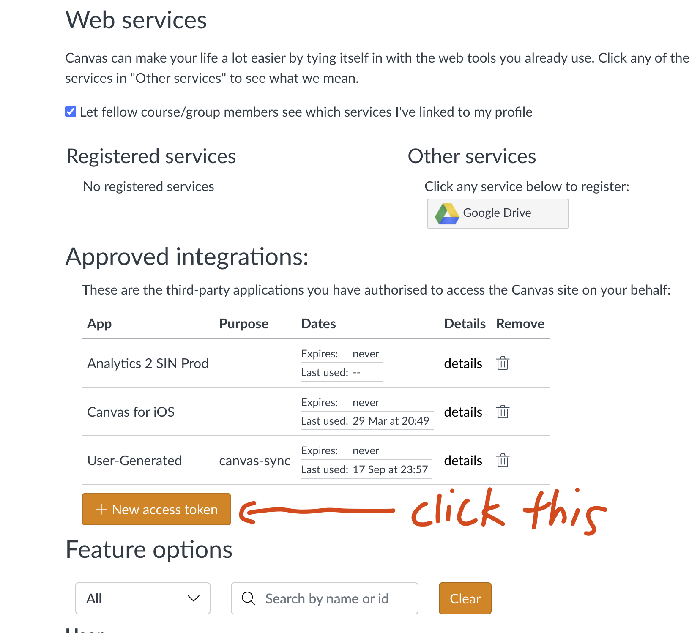
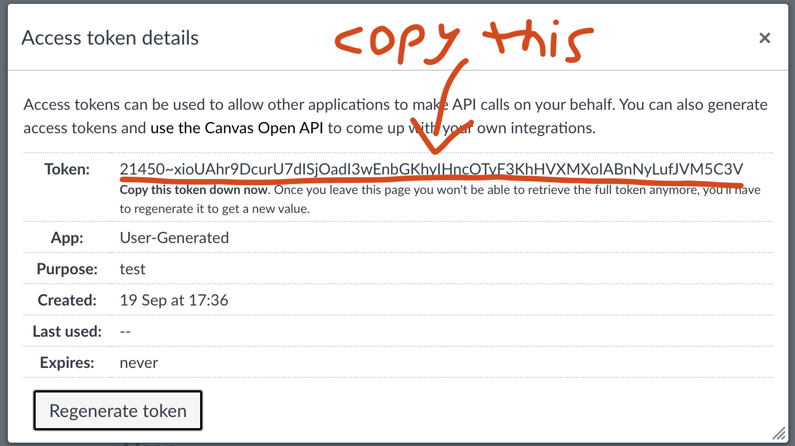
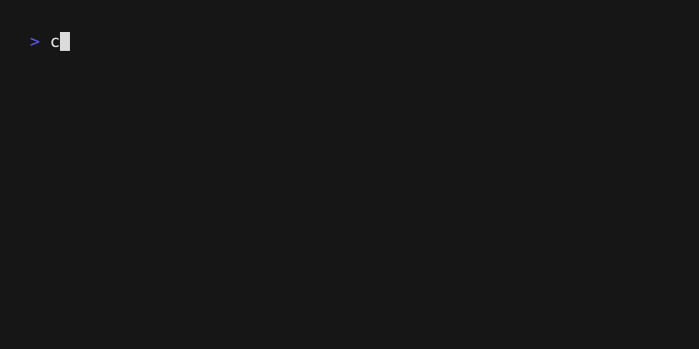
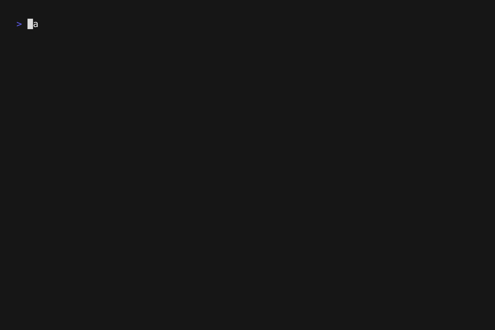
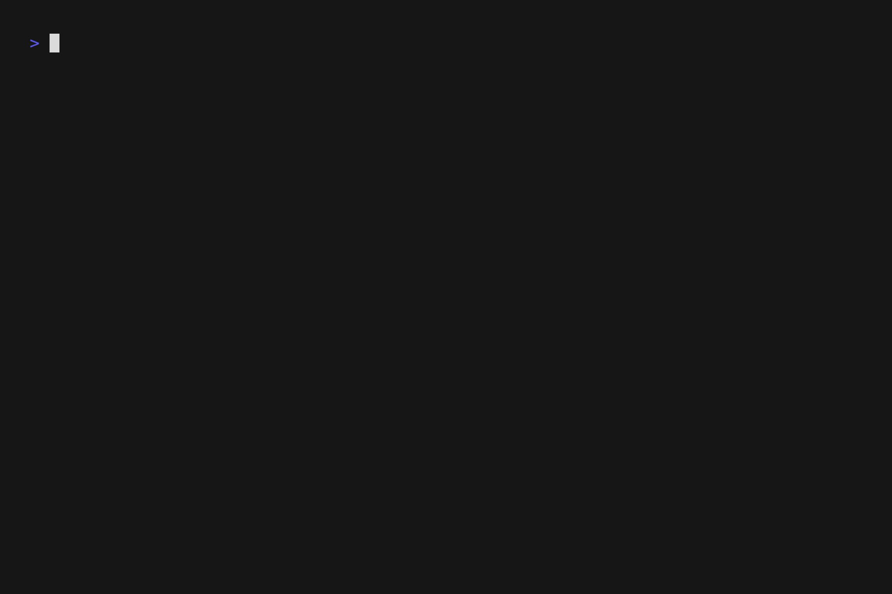

<!-- omit in toc -->
# canvas-sync

CLI to download (course files, videos, etc) & view (deadlines, events, announcements) from [Canvas](https://www.instructure.com/canvas)

<!-- omit in toc -->
## Contents

- [Install](#install)
  - [Brew](#brew)
  - [Autocomplete (for advanced users)](#autocomplete-for-advanced-users)
    - [zsh](#zsh)
    - [bash](#bash)
    - [fish (not necessary if you installed fish via homebrew)](#fish-not-necessary-if-you-installed-fish-via-homebrew)
- [Usage](#usage)
  - [Log in (recommended for beginners)](#log-in-recommended-for-beginners)
  - [Access token (recommended for optimal performance)](#access-token-recommended-for-optimal-performance)
- [Config](#config)
- [Commands](#commands)
  - [Init](#init)
  - [Pull](#pull)
    - [Pull Files](#pull-files)
    - [Pull Videos](#pull-videos)
  - [Update](#update)
    - [Update Files](#update-files)
    - [Update Videos](#update-videos)
  - [View](#view)
    - [View Deadlines](#view-deadlines)
    - [View Events (lectures/tutorials)](#view-events-lecturestutorials)
    - [View Announcements](#view-announcements)
- [LICENSE](#license)

## Install

### Brew

```bash
brew install aidanaden/tools/canvas-sync
```

You can also download directly from the [releases](https://github.com/aidanaden/canvas-sync/releases) page

### Autocomplete (for advanced users)

Add autocompletion for canvas-sync in your terminal:

#### zsh

<details>
  <summary>
    Code for zsh autocomplete
  </summary>

  ```bash
  # replace '~/.zshrc' with wherever your zsh config file is
  echo "\n\nif type brew &>/dev/null
  then
    FPATH="$(brew --prefix)/share/zsh/site-functions:${FPATH}"

    autoload -Uz compinit
    compinit
  fi" >> ~/.zshrc && source ~/.zshrc

  ```

</details>

#### bash

<details>
  <summary>
    Code for bash autocomplete
  </summary>

  ```bash
  # replace '~/.bash_profile' with wherever your bash config file is
  echo "if type brew &>/dev/null
  then
    HOMEBREW_PREFIX="$(brew --prefix)"
    if [[ -r "${HOMEBREW_PREFIX}/etc/profile.d/bash_completion.sh" ]]
    then
      source "${HOMEBREW_PREFIX}/etc/profile.d/bash_completion.sh"
    else
      for COMPLETION in "${HOMEBREW_PREFIX}/etc/bash_completion.d/"*
      do
        [[ -r "${COMPLETION}" ]] && source "${COMPLETION}"
      done
    fi
  fi" >> ~/.bash_profile && source ~/.bash_profile
  ```

</details>

#### fish (not necessary if you installed fish via homebrew)

<details>
  <summary>
    Code for fish autocomplete
  </summary>

  ```bash
  # replace '~/.config/fish/config.fish' with wherever your fish config file is
  echo "if test -d (brew --prefix)"/share/fish/completions"
      set -gx fish_complete_path $fish_complete_path (brew --prefix)/share/fish/completions
  end

  if test -d (brew --prefix)"/share/fish/vendor_completions.d"
      set -gx fish_complete_path $fish_complete_path (brew --prefix)/share/fish/vendor_completions.d
  end" >> ~/.config/fish/config.fish && source ~/.config/fish/config.fish
  ```

</details>

## Usage

Canvas-sync requires logging in to your canvas account. There are 2 authentication methods:

### Log in (recommended for beginners)

  1. Log in to your canvas account on your browser (chrome preferred)
  2. That's it! You can run one of the command from [here](#commands)
  3. Note: you might be prompted to log in to your canvas account from time to time

### Access token (recommended for optimal performance)

  1. Access tokens allow canvas-sync to interact with canvas without logging in. To create an access token, head to your [canvas settings](https://canvas.nus.edu.sg/profile/settings) (note: this link is for nus students, for non-nus students head to `<your school canvas website>/profile/settings`)
  2. Click the "New access token" button and enter "canvas-sync" in the "Purpose" field. Make sure to leave the "Expires" field **blank**

  
  
  

  3. Copy the token value displayed and paste it in the `~/.canvas-sync/config.yaml` file as below

  ```bash
   # paste your access token below
   access_token: # <paste your access token>
   # replace with your preferred location to store canvas data
   data_dir: $HOME/.canvas-sync/data
   # replace with your canvas url
   canvas_url: https://canvas.nus.edu.sg
  ```

## Config

All configuration is done in the `$HOME/.canvas-sync/config.yaml` file.

3 values can be configured:

- `access_token`: token generated by the canvas user (you) to download from canvas directly, if not filled canvas-sync will prompt you to log in
- `data_dir`: directory to store downloaded canvas data, defaults to `$HOME/.canvas-sync/data`  
- `canvas_url`: URL of your target canvas site, defaults to `https://canvas.nus.edu.sg`

To create a default config file, run `canvas-sync init`

## Commands

### Init

Creates a new config file in the default directory `~/.canvas-sync`



### Pull

Downloads data (files, videos, etc) from canvas, overwrites all existing data

#### Pull Files

View documentation via `pull files -h`:




#### Pull Videos

WIP

### Update

Updates downloaded data (files, videos, etc) from canvas

#### Update Files

View documentation via `update files -h`:




#### Update Videos

WIP

### View

Display data from canvas (deadlines, events, announcements, etc)

#### View Deadlines

WIP

#### View Events (lectures/tutorials)

WIP

#### View Announcements

WIP

## LICENSE

MIT
